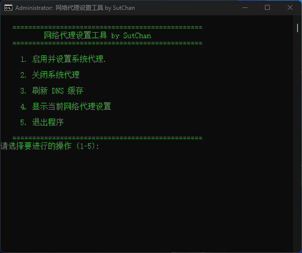

# Windows 网络代理设置工具

[English Version](README.md)

一个简单而强大的批处理脚本，用于快速管理 Windows 系统代理设置。非常适合需要频繁在直连和代理网络环境之间切换的用户。

## ✨ 功能特性

*   **启用并设置代理**：快速为系统设置 HTTP 代理服务器地址和端口。
*   **一键关闭代理**：迅速清除系统代理设置，恢复直连。
*   **刷新 DNS 缓存**：解决因 DNS 缓存导致的网络问题。
*   **查看当前设置**：清晰地显示当前代理是否启用及其地址。
*   **交互式菜单**：友好的命令行菜单，操作直观。
*   **管理员权限检查**：自动检测是否以管理员身份运行，并给出提示。
*   **语言自动检测**：根据你的系统语言环境，自动切换中英文界面。

## 🚀 如何使用

1.  从本仓库下载 `proxy_tool.bat` 文件。
2.  右键点击 `proxy_tool.bat` 文件。
3.  选择 **“以管理员身份运行”**。
4.  根据屏幕上的菜单提示进行操作。

## ⚠️ 常见问题 (Troubleshooting)

**问：脚本中的中文显示为乱码，或者提示 `'xxx' 不是内部或外部命令...` 错误？**

**答：** 这是最常见的问题，由文件编码错误导致。

**解决方法：**
1.  用 Windows **记事本** 打开 `.bat` 文件。
2.  点击左上角 **“文件”** -> **“另存为...”**。
3.  在弹出的窗口底部，将 **“编码”** 选项从 `UTF-8` 修改为 **`ANSI`**。
4.  保存并覆盖原文件，然后重新运行脚本即可。

## 📜 许可证

本项目采用 [MIT License](LICENSE) 许可证。

## 👤 作者

*   **脚本作者:** SutChan